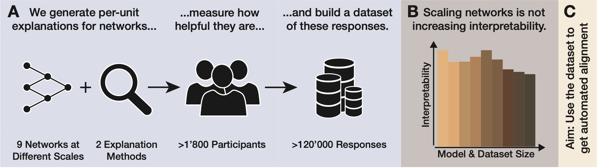

<p align="center">
  <a href="https://brendel-group.github.io/imi/">Project Page</a> •
  <a href="https://arxiv.org/abs/2307.05471">Paper</a> •
  <a href="https://zenodo.org/records/8131197">Dataset</a> •
  <a href="#citation">Citation</a>
</p>

# Scale Alone Does not Improve Mechanistic Interpretability in Vision Models
This repository contains code to reproduce the experiments described in the NeurIPS 2023 Spotlight paper [Scale Alone Does not Improve Mechanistic Interpretability in Vision Models](https://arxiv.org/abs/2307.05471) by Roland S. Zimmermann*, Thomas Klein*, Wieland Brendel'.
If you have any questions, please reach out via email or create an issue here on GitHub and we'll try to answer it.

## Structure
The [mturk](mturk/README.md) folder contains the implementation of the experiments' UI. Tools to host this on a web server can be found in the [server](server/README.md) directory. To generate the stimuli used in the experiments, look at the [tools/data-generation](tools/data-generation/README.md) folder. For performing the experiment using AWS Mechanical Turk, use the tools proved in [tools/mturk](tools/mturk/README.md). Finally, to evaluate the data and re-create the figures from the paper, use the notebooks provided in [tools/data-analysis](tools/data-analysis/README.md).

## Citation
```bibtex
@inproceedings{zimmermann2023scale,
  title={Scale Alone Does not Improve Mechanistic Interpretability in Vision Models},
  author={Zimmermann, Roland S and Klein, Thomas and Brendel, Wieland},
  booktitle={Thirty-seventh Conference on Neural Information Processing Systems},
  year={2023}
}
```